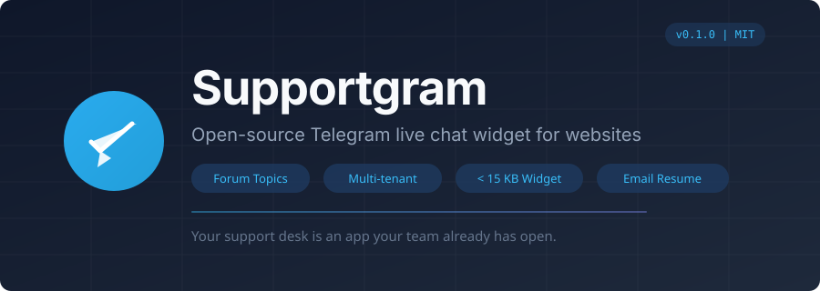
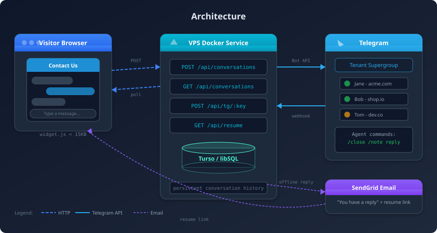
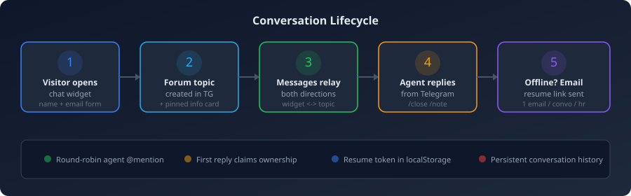

<p align="center">
  
</p>

<p align="center">
  
  
  = 20" />
  
  
  
</p>

<h1 align="center">Supportgram</h1>

<p align="center">
  <strong>Open-source Telegram live chat widget for websites.<br/>Turn your Telegram group into a customer support desk.</strong>
</p>

<p align="center">
Supportgram is a lightweight, multi-tenant live chat widget that routes website visitor conversations directly into Telegram forum topics. Your support team reads, replies, and resolves conversations entirely inside Telegram — no separate dashboard, no new tool to learn.
</p>

<p align="center"><em>Your support desk is an app your team already has open.</em></p>

---

## Why Supportgram?

Most live chat tools force agents into yet another web inbox. Supportgram takes the opposite approach — it meets your team where they already are: **Telegram**.

- **No agent dashboard** — Conversations appear as Telegram forum topics. Reply from the Telegram app on desktop, mobile, or web.
- **Multi-tenant B2B SaaS** — One deployment serves multiple businesses; each gets its own Telegram bot and supergroup.
- **One script tag** — Drop a `<script>` tag on your website and you're live in minutes.
- **Tiny footprint** — The embeddable widget is under 15 KB gzipped. Pure vanilla JS, zero dependencies.
- **Offline email resume** — When visitors leave, they get an email with a link to pick up the conversation later.
- **Privacy-first** — 90-day auto-purge of conversations and Telegram topics. Per-tenant origin allowlists. No third-party trackers.

---

## How It Works

<p align="center">
  
</p>

<p align="center">
  
</p>

1. Visitor opens the chat widget and fills in a short contact form (name + email).
2. A **Telegram forum topic** is created in your supergroup, with a pinned info card.
3. Messages relay both ways: visitor to topic, agent replies back to the widget.
4. If the visitor goes offline, they receive an **email with a resume link** to continue the conversation.
5. Agents use `/close` to resolve and `/note` for internal-only messages.

---

## Features

| Feature | Description |
|---|---|
| **Forum-topic threading** | Each conversation gets its own Telegram topic — no message confusion |
| **Round-robin assignment** | Auto @-mentions the next available agent; first reply claims ownership |
| **Pre-chat contact form** | Captures visitor name and email before the conversation starts |
| **Identified visitors** | Pass `data-name` and `data-email` to skip the form for logged-in users |
| **HMAC verified identity** | Secure identity verification prevents spoofing of visitor details |
| **Conversation history** | Visitors can see and resume past conversations from the widget |
| **Email notifications** | Offline visitors get a "you have a reply" email with a one-click resume link |
| **Agent commands** | `/close` to resolve, `/note` for internal messages never shown to visitors |
| **Customizable widget** | Accent color, title, greeting text — all configurable via attributes or JS |
| **Origin allowlisting** | Widget requests are validated against registered domains (CORS + Origin check) |
| **90-day auto-purge** | Conversations and Telegram topics are automatically cleaned up via cron |
| **Rate limiting** | Per-IP and per-conversation throttles protect against abuse |

---

## Quick Start

### Prerequisites

- **Node.js >= 20**
- A **Telegram bot** (create one via [@BotFather](https://t.me/BotFather))
- A **Telegram supergroup with Topics enabled** (the bot must be an admin with "Manage Topics" permission)

### 1. Clone and install

```bash
git clone https://github.com/Sorbh/supportgram.git
cd supportgram
npm install
```

### 2. Configure environment

```bash
cp .env.example .env
```

Edit `.env` with your settings:

```env
TURSO_DATABASE_URL=file:data/local.db   # local SQLite for development
TURSO_AUTH_TOKEN=                         # leave blank for local dev
BASE_URL=https://your-domain.com
SENDGRID_API_KEY=your_sendgrid_key
SENDGRID_FROM_EMAIL=support@your-domain.com
CRON_SECRET=a_random_secret
```

### 3. Seed your first business

```bash
npm run seed -- \
  --name "My Business" \
  --bot-token "123456:ABC-DEF..." \
  --supergroup -100123456789 \
  --origins "https://mysite.com,https://www.mysite.com" \
  --agents "111111:Alice:alice_tg,222222:Bob:"
```

The `--agents` format is `tg_user_id:DisplayName:tg_username` (username is optional), comma-separated. The script prints a **Public Key** (`pk_...`) — you'll need it for the widget embed.

### 4. Build and run locally

```bash
npm run build:widget
vercel dev
```

Open `http://localhost:3000/test.html` and set your public key in `data-key`.

---

## Embedding the Widget

Add a single script tag to your website:

```html
<script
  src="https://your-domain.com/widget.js"
  data-key="YOUR_PUBLIC_KEY"
></script>
```

### Configuration options

All attributes are optional and can also be set via `window.SupportgramSettings`:

| Attribute | Default | Description |
|---|---|---|
| `data-key` | *(required)* | Your tenant public key (`pk_...`) |
| `data-color` | `#1E8FD5` | Widget accent color (hex) |
| `data-title` | `Contact Us` | Header and teaser title |
| `data-greeting` | `Let me know if you have any questions!` | Proactive teaser message shown once to new visitors |
| `data-name` | — | Pre-fill visitor name (skips form if email also set) |
| `data-email` | — | Pre-fill visitor email (skips form if name also set) |

### Identified visitors (skip the form)

For logged-in users whose identity you already know:

```html
<!-- Option A: data attributes -->
<script
  src="https://your-domain.com/widget.js"
  data-key="YOUR_PUBLIC_KEY"
  data-name="Jane Smith"
  data-email="jane@example.com"
></script>

<!-- Option B: settings object (set before the script tag) -->
<script>
  window.SupportgramSettings = {
    name: "Jane Smith",
    email: "jane@example.com"
  };
</script>
<script src="https://your-domain.com/widget.js" data-key="YOUR_PUBLIC_KEY"></script>
```

### JavaScript API

```js
// Open the widget programmatically
Supportgram.open();

// Identify a visitor at runtime (e.g., after login)
Supportgram.identify({ name: "Jane Smith", email: "jane@example.com" });

// Reset identity (e.g., on logout)
Supportgram.reset();
```

---

## Tenant Administration (CLI)

There is no admin panel — tenants are managed via the seed CLI:

```bash
# List all tenants
npm run seed -- --list

# Create a new tenant (also registers the Telegram webhook)
npm run seed -- \
  --name "Acme Corp" \
  --bot-token "123456:ABC..." \
  --supergroup -100123456789 \
  --origins "https://acme.com,https://www.acme.com" \
  --agents "123456:Alice:alice_tg,789012:Bob:"
```

---

## Deployment

Supportgram runs on **Vercel** (serverless functions + cron) with a **Turso** (libSQL) database.

### Environment variables

| Variable | Description |
|---|---|
| `TURSO_DATABASE_URL` | Turso database URL (or `file:data/local.db` for local dev) |
| `TURSO_AUTH_TOKEN` | Turso auth token (blank for local dev) |
| `BASE_URL` | Your public URL (e.g., `https://supportgram.io`) |
| `SENDGRID_API_KEY` | SendGrid API key for email notifications |
| `SENDGRID_FROM_EMAIL` | Sender email address for notifications |
| `CRON_SECRET` | Secret to protect the cron purge endpoint |

### Deploy to Vercel

```bash
npm i -g vercel
vercel
```

The `vercel.json` includes a daily cron job for the 90-day purge and URL rewrites for resume links.

---

## Tech Stack

| Component | Technology |
|---|---|
| **Backend** | Vercel Serverless Functions (Node.js 20+, ESM) |
| **Database** | Turso / libSQL (SQLite-compatible, local file for dev) |
| **Widget** | Vanilla JavaScript, bundled with esbuild (< 15 KB gzipped) |
| **Telegram** | Raw Bot API calls (no SDK) via webhooks |
| **Email** | SendGrid transactional emails |
| **Scheduling** | Vercel Cron (nightly purge) |

---

## Project Structure

```
supportgram/
+-- api/
|   +-- conversations.js    # Create/list conversations, send/poll messages
|   +-- resume.js           # Email resume link handler
|   +-- tg/[key].js         # Telegram webhook receiver (per-tenant)
|   +-- cron/purge.js       # Nightly 90-day data purge
+-- db/
|   +-- schema.js           # SQLite schema (businesses, agents, conversations, messages)
|   +-- index.js            # Database connection + helpers
+-- lib/
|   +-- relay.js            # Message relay logic (widget <-> Telegram)
|   +-- telegramApi.js      # Telegram Bot API wrapper
|   +-- email.js            # SendGrid email notifications
+-- widget/
|   +-- src/widget.js       # Embeddable chat widget source
|   +-- build.mjs           # esbuild bundler script
+-- scripts/
|   +-- seed.mjs            # CLI for tenant management
+-- public/
|   +-- test.html           # Local testing page
+-- config.js               # Environment configuration
+-- vercel.json             # Vercel deployment config
+-- package.json
```

---

## Roadmap

- [ ] Self-serve tenant onboarding and admin dashboard
- [ ] WebSocket / SSE real-time messaging (replace short-polling)
- [ ] File and image upload support
- [ ] AI auto-reply and smart triage
- [ ] SLA timers, CSAT surveys, canned replies
- [ ] Inbound email bridge
- [ ] Analytics and reporting dashboard

---

## Contributing

Contributions are welcome! Please open an issue first to discuss what you'd like to change.

1. Fork the repository
2. Create your feature branch (`git checkout -b feature/amazing-feature`)
3. Commit your changes (`git commit -m 'Add amazing feature'`)
4. Push to the branch (`git push origin feature/amazing-feature`)
5. Open a Pull Request

---

## License

This project is licensed under the MIT License. See the [LICENSE](LICENSE) file for details.

---

## Acknowledgments

Built with [Vercel](https://vercel.com), [Turso](https://turso.tech), and the [Telegram Bot API](https://core.telegram.org/bots/api).

---

<p align="center">
  <b>Supportgram</b> &mdash; Telegram live chat widget for your website<br/>
  <a href="https://github.com/Sorbh/supportgram">GitHub</a> &middot;
  <a href="https://github.com/Sorbh/supportgram/issues">Issues</a> &middot;
  <a href="LICENSE">MIT License</a>
</p>
